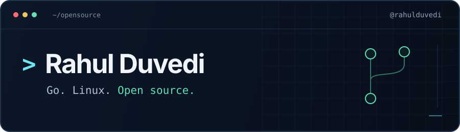
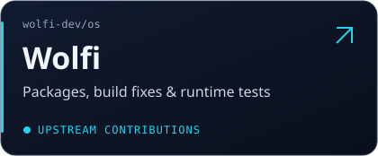
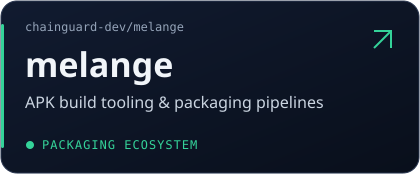
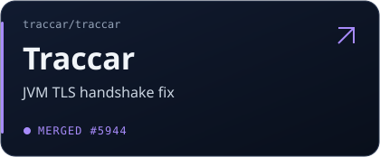
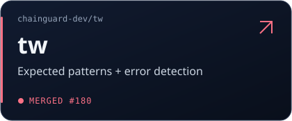
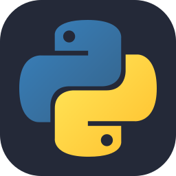
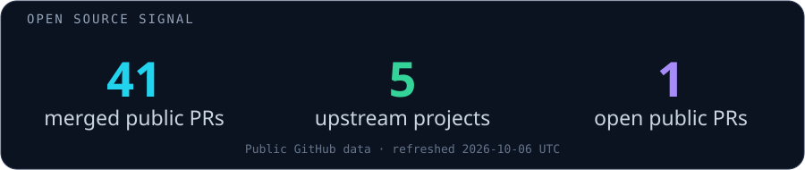

  
  

### `$ whoami`

**Engineer at [Chainguard](https://www.chainguard.dev/). Tinkerer at heart.**

I build and debug the details that make software run reliably: Linux packages, containers, backend systems, and developer tools. A broken build, a tricky runtime bug, a small useful fix, then upstream.

### ⚡ Open source playground

  
  
  
  

<b>🔎 Explore the work behind the cards</b>

| Project | My open source work |
| :--- | :--- |
| [Wolfi](https://github.com/wolfi-dev/os) | Package additions, build fixes, and integration tests: [Trivy Operator](https://github.com/wolfi-dev/os/pull/52818), [SpiceDB tests and operator](https://github.com/wolfi-dev/os/pull/62939), and [Harbor builds, updates, and tests](https://github.com/wolfi-dev/os/pull/64449). |
| [melange](https://github.com/chainguard-dev/melange) | Contributor to the APK build tooling behind declarative packaging pipelines. |
| [Traccar](https://github.com/traccar/traccar) | [Fixed a TLS handshake failure](https://github.com/traccar/traccar/pull/5944) by configuring Java's `SSLEngine` for server mode. |
| [Chainguard's tw](https://github.com/chainguard-dev/tw) | [Extended `kgrep` and `dgrep`](https://github.com/chainguard-dev/tw/pull/180) to check expected patterns and unwanted errors together. |

More upstream work: [Trueforge agent error handling](https://github.com/truefoundry/trueforge/pull/822) · [Go runtime compatibility report](https://github.com/odigos-io/go-rtml/issues/4).

### 🛠️ My toolbox

  
  
  
  
  
  
  
  
  

### 📡 Open source signal

### 🐍 Follow the contribution trail

<b>Build useful things. Fix the rough edges. Share the work.</b>

  
   
  Icons by <a href="https://github.com/tandpfun/skill-icons">Skill Icons</a> · contribution animation by <a href="https://github.com/Platane/snk">Platane/snk</a>

